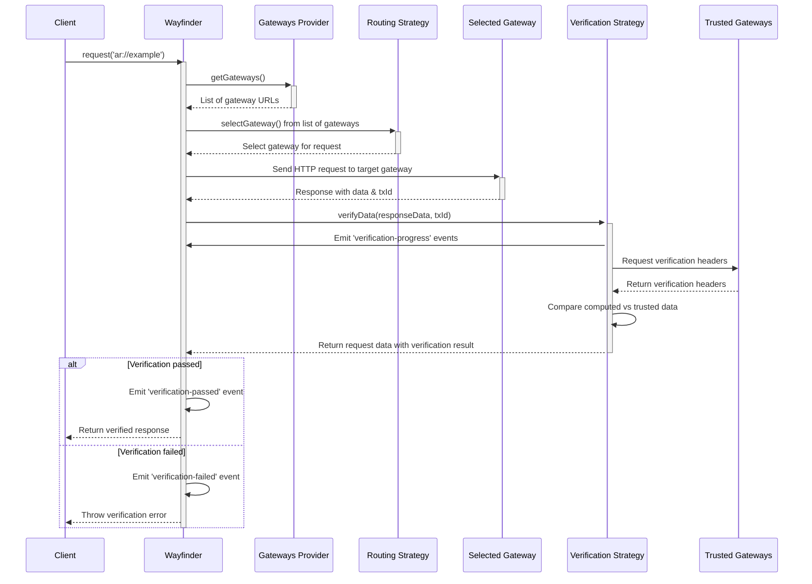

# Wayfinder Core

`@ar.io/wayfinder-core` is the core library for the Wayfinder project. It provides the core functionality for routing and verifying data through the ar.io network.

## Quick Start

### Installation

`@ar.io/wayfinder-core` is currently available as an alpha release. To install the latest version, run:

```bash
npm install @ar.io/wayfinder-core
# or
yarn add @ar.io/wayfinder-core
```

### Basic Usage

```javascript
import { Wayfinder } from '@ar.io/wayfinder-core';

// create a new Wayfinder instance with default settings
const wayfinder = new Wayfinder();

// use Wayfinder to fetch and verify data using ar:// protocol
const response = await wayfinder.request('ar://example-name');
```

### Custom Configuration

You can customize the wayfinder instance with different gateways, verification strategies, and routing strategies based on your use case.

Example:

> _Wayfinder client that caches the top 10 gateways by operator stake from the ARIO Network for 1 hour and uses the fastest pinging routing strategy to select the fastest gateway for requests._

```javascript
import { Wayfinder, NetworkGatewaysProvider, SimpleCacheGatewaysProvider, FastestPingRoutingStrategy, HashVerificationStrategy } from '@ar.io/wayfinder-core';
import { ARIO } from '@ar.io/sdk';

const wayfinder = new Wayfinder({
  // cache the top 10 gateways by operator stake from the ARIO Network for 1 hour
  gatewaysProvider: new SimpleCacheGatewaysProvider({
    ttlSeconds: 60 * 60, // cache the gateways for 1 hour
    gatewaysProvider: new NetworkGatewaysProvider({
      ario: ARIO.mainnet(),
      sortBy: 'operatorStake',
      sortOrder: 'desc',
      limit: 10,
    }),
  }),
  // routing settings
  routingSettings: {
    // use the fastest pinging strategy to select the fastest gateway for requests
    strategy: new FastestPingRoutingStrategy({
      timeoutMs: 1000,
      probePath: '/ar-io/info',
    }),
    // events
    events: {
      onRoutingStarted: (event) => {
        console.log('Routing started!', event);
      },
      onRoutingSkipped: (event) => {
        console.log('Routing skipped!', event);
      },
      onRoutingSucceeded: (event) => {
        console.log('Routing succeeded!', event);
      },
    },
  },
  // verification settings
  verificationSettings: {
    // enable verification - if false, verification will be skipped for all requests
    enabled: true,
    // verify the data using the hash of the data against a list of trusted gateways
    strategy: new HashVerificationStrategy({
      trustedGateways: ['https://permagate.io'],
    }),
    // strict verification - if true, verification failures will cause requests to fail
    strict: true,
    // events
    events: {
      onVerificationProgress: (event) => {
        console.log('Verification progress!', event);
      },
      onVerificationSucceeded: (event) => {
        console.log('Verification succeeded!', event);
      },
      onVerificationFailed: (event) => {
        console.log('Verification failed!', event);
      },
    },
  },
});
```

## ar:// Protocol

Wayfinder supports several ar:// URL formats:

```bash
ar://TRANSACTION_ID              // Direct transaction ID
ar://NAME                        // ArNS name (paths supported)
ar:///info                       // Gateway endpoint (/info)
```

## Gateway Providers

Gateway providers are responsible for providing a list of gateways to Wayfinder to choose from when routing requests. By default, Wayfinder will use the `NetworkGatewaysProvider` to get a list of gateways from the ARIO Network.

### NetworkGatewaysProvider

Returns a list of gateways from the ARIO Network based on on-chain metrics. You can specify on-chain metrics for gateways to prioritize the highest quality gateways. This is the default gateway provider and is recommended for most users.

```javascript
// requests will be routed to one of the top 10 gateways by operator stake
const gatewayProvider = new NetworkGatewaysProvider({
  ario: ARIO.mainnet(),
  sortBy: 'operatorStake', // sort by operator stake | 'totalDelegatedStake'
  sortOrder: 'desc', // 'asc'
  limit: 10, // number of gateways to return
});
```

### Static Gateway Provider

The static gateway provider returns a list of gateways that you provide. This is useful for testing or for users who want to use a specific gateway for all requests.

```javascript
const gatewayProvider = new StaticGatewaysProvider({
  gateways: ['https://arweave.net'],
});
```

## Routing Strategies

Wayfinder supports multiple routing strategies to select target gateways for your requests.

| Strategy                     | Description                                    | Use Case                                |
| ---------------------------- | ---------------------------------------------- | --------------------------------------- |
| `RandomRoutingStrategy`      | Selects a random gateway from a list           | Good for load balancing and resilience  |
| `StaticRoutingStrategy`      | Always uses a single gateway                   | When you need to use a specific gateway |
| `RoundRobinRoutingStrategy`  | Selects gateways in round-robin order          | Good for load balancing and resilience  |
| `FastestPingRoutingStrategy` | Selects the fastest gateway based on ping time | Good for performance and latency        |

### RandomRoutingStrategy

Selects a random gateway from a list of gateways.

```javascript
const routingStrategy = new RandomRoutingStrategy();

const gateway = await routingStrategy.selectGateway({
  gateways: ['https://arweave.net', 'https://permagate.io'],
});
```

### StaticRoutingStrategy

```javascript
import { Wayfinder, StaticRoutingStrategy } from '@ar.io/wayfinder-core';

const routingStrategy = new StaticRoutingStrategy({
  gateway: 'https://arweave.net',
});

const gateway = await routingStrategy.selectGateway(); // always returns the same gateway
```

### RoundRobinRoutingStrategy

Selects gateways in round-robin order. The gateway list is stored in memory and is not persisted across instances.

```javascript
import { Wayfinder, NetworkGatewaysProvider, RoundRobinRoutingStrategy } from '@ar.io/wayfinder-core';
import { ARIO } from '@ar.io/sdk';

const gatewayProvider = new NetworkGatewaysProvider({
  ario: ARIO.mainnet(),
  sortBy: 'operatorStake',
  sortOrder: 'desc',
  limit: 10,
});

// provide the gateways to the routing strategy on initialization to track the request count per gateway.
// Any additional gateways provided to the selectGateway method will be ignored.
const routingStrategy = new RoundRobinRoutingStrategy({
  gateways: await gatewayProvider.getGateways(),
});

const gateway = await routingStrategy.selectGateway(); // returns the next gateway in the list
```

### FastestPingRoutingStrategy

Selects the fastest gateway based simple HEAD request to the specified route.

```javascript
import { Wayfinder, FastestPingRoutingStrategy } from '@ar.io/wayfinder-core';

const routingStrategy = new FastestPingRoutingStrategy({
  timeoutMs: 1000,
});

// will select the fastest gateway from the list based on the ping time of the /ar-io/info route
const gateway = await routingStrategy.selectGateway({
  gateways: ['https://slow.net', 'https://medium.net', 'https://fast.net'],
});
```

## Verification Strategies

Wayfinder includes verification mechanisms to ensure the integrity of retrieved data. Verification strategies offer different trade-offs between complexity, performance, and security.

| Verifier                        | Complexity | Performance | Security | Description                                                                                                  |
| ------------------------------- | ---------- | ----------- | -------- | ------------------------------------------------------------------------------------------------------------ |
| `HashVerificationStrategy`      | Low        | High        | Low      | Verifies data integrity using SHA-256 hash comparison of the returned data                                   |
| `DataRootVerificationStrategy`  | Medium     | Medium      | Low      | Verifies data using Arweave by computing the data root for the transaction (most useful for L1 transactions) |
| `SignatureVerificationStrategy` | Medium     | Medium      | Medium   | Verifies signature of an Arweave transaction or data item using signature data provided by the Arweave network (L1 transactions), or trusted gateways (ANS-104 data items)|

### HashVerificationStrategy

Verifies data integrity using SHA-256 hash comparison. This is the default verification strategy and is recommended for most users looking for a balance between security and performance.

```javascript
import { Wayfinder, HashVerificationStrategy } from '@ar.io/wayfinder-core';

const wayfinder = new Wayfinder({
  verificationSettings: {
    strategy: new HashVerificationStrategy({
    trustedGateways: ['https://permagate.io'],
    }),
  },
});
```

### DataRootVerificationStrategy

Verifies data integrity using Arweave by computing the data root for the transaction. This is useful for L1 transactions and is recommended for users who want to ensure the integrity of their data.

```javascript
import { Wayfinder, DataRootVerificationStrategy } from '@ar.io/wayfinder-core';

const wayfinder = new Wayfinder({
  verificationSettings: {
    strategy: new DataRootVerificationStrategy({
      trustedGateways: ['https://permagate.io'],
    }),
  },
});
```

### SignatureVerificationStrategy

Verifies signatures of Arweave transactions and data items. Headers are retrieved from trusted gateways for use during verification. For a transaction, its data root is computed while streaming its data and then utilized alongside its headers for verification. For data items, the ANS-104 deep hash method of signature verification is used.

```javascript
import { Wayfinder, SignatureVerificationStrategy } from '@ar-io/sdk';

const wayfinder = new Wayfinder({
  verificationSettings: {
    strategy: new SignatureVerificationStrategy({
      trustedGateways: ['https://permagate.io'],
    }),
  },
});
```

## Monitoring and Events

Wayfinder emits events during the routing and verification process, allowing you to monitor its operation. You can provide these events to the Wayfinder constructor or use the event emitter directly.

```javascript
const wayfinder = new Wayfinder({
  routingSettings: {
    events: {
      onRoutingStarted: (event) => {
        console.log('Routing started!', event);
      },
      onRoutingSkipped: (event) => {
        console.log('Routing skipped!', event);
      },
      onRoutingSucceeded: (event) => {
        console.log('Routing succeeded!', event);
      },
    },
  },
  verificationSettings: {
    events: {
      onVerificationPassed: (event) => {
      console.log(`Verification passed for transaction: ${event.txId}`);
    },
    onVerificationFailed: (event) => {
      console.error(
        `Verification failed for transaction: ${event.txId}`,
        event.error,
      );
    },
    onVerificationProgress: (event) => {
      const percentage = (event.processedBytes / event.totalBytes) * 100;
      console.log(
        `Verification progress for ${event.txId}: ${percentage.toFixed(2)}%`,
      );
    },
    },
  },
});

// Or use the event emitter directly
wayfinder.emitter.on('routing-succeeded', (event) => {
  console.log(`Request routed to: ${event.targetGateway}`);
});

wayfinder.emitter.on('routing-failed', (event) => {
  console.error(`Routing failed: ${event.error.message}`);
});

wayfinder.emitter.on('verification-progress', (event) => {
  console.log(`Verification progress: ${event.progress}%`);
});

wayfinder.emitter.on('verification-succeeded', (event) => {
  console.log(`Verification succeeded: ${event.txId}`);
});

wayfinder.emitter.on('verification-failed', (event) => {
  console.error(`Verification failed: ${event.error.message}`);
});
```

## Advanced Usage

### Custom URL Resolution

Returns the resolved URL for a given ar:// URL. This is useful for debugging and for users who want to know the target gateway for a given ar:// URL.

```javascript
// Get the resolved URL without making a request
const redirectUrl = await wayfinder.resolveUrl({
  originalUrl: 'ar://example-name',
});
console.log(`This request would be routed to: ${redirectUrl}`);
```

## Request Flow

The following sequence diagram illustrates how Wayfinder processes requests:


