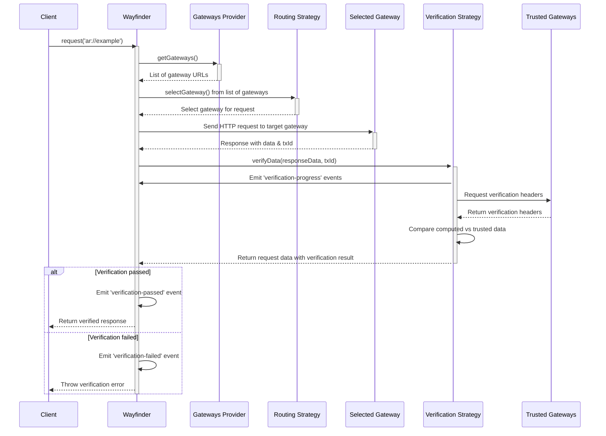

# Wayfinder Core

`@ar.io/wayfinder-core` is the core library for the Wayfinder project. It provides the core functionality for routing and verifying data through the ar.io network.

## Quick Start

### Installation

To install the latest version, run:

```bash
npm install @ar.io/wayfinder-core
# or
yarn add @ar.io/wayfinder-core
```

### Basic Usage

```javascript
import { ARIO } from '@ar.io/sdk';
import { Wayfinder } from '@ar.io/wayfinder-core';

// create a new Wayfinder instance that uses the top 10 gateways by operator stake from the ARIO Network
const wayfinder = new Wayfinder({
  gatewaysProvider: new NetworkGatewaysProvider({
    ario: ARIO.mainnet(),
    sortBy: 'operatorStake',
    sortOrder: 'desc',
    limit: 10,
  }),
});

// use Wayfinder to fetch and verify data using ar:// protocol
const response = await wayfinder.request('ar://example-name');
```

## ar:// Protocol

Wayfinder supports several ar:// URL formats:

```bash
ar://TRANSACTION_ID              // Direct transaction ID
ar://NAME                        // ArNS name (paths supported)
ar:///info                       // Gateway endpoint (/info)
```

## Dynamic Wayfinder URLs

Wayfinder supports a `resolveUrl` method which generates dynamic redirect URLs to a target gateway based on the provided routing strategy. This function can be used to directly replace any hard-coded gateway URLs, and instead use Wayfinder's routing logic to select a gateway for the request.

### Dynamic routing for ArNS names

Given an ArNS name, the redirect URL will be the same as the original URL, but with the gateway selected by Wayfinder's routing strategy.

```javascript
const redirectUrl = await wayfinder.resolveUrl({
  arnsName: 'ardrive',
});
// results in https://ardrive.<selected-gateway>
```

### Dynamic routing for txIds

Given a txId, the redirect URL will be the same as the original URL, but with the gateway selected by Wayfinder's routing strategy.

```javascript
const redirectUrl = await wayfinder.resolveUrl({
  txId: 'example-tx-id',
});
// results in https://<selected-gateway>/example-tx-id
```

### Dynamic routing for legacy arweave.net or arweave.dev URLs

Given a legacy arweave.net or arweave.dev URL, the redirect URL will be the same as the original URL, but with the gateway selected by Wayfinder's routing strategy.

```javascript
const redirectUrl = await wayfinder.resolveUrl({
  originalUrl: 'https://arweave.net/example-tx-id',
});
// results in https://<selected-gateway>/example-tx-id
```

### Dynamic routing for ar:// URLs

Given an ar:// URL, the redirect URL will be the same as the original URL, but with the gateway selected by Wayfinder's routing strategy.

```javascript
const redirectUrl = await wayfinder.resolveUrl({
  originalUrl: 'ar://example-name/subpath?query=value',
});
// results in https://<selected-gateway>/example-name/subpath?query=value
```

## Gateway Providers

Gateway providers are responsible for providing a list of gateways to Wayfinder to choose from when routing requests. By default, Wayfinder will use the `NetworkGatewaysProvider` to get a list of gateways from the ARIO Network.

### NetworkGatewaysProvider

Returns a list of gateways from the ARIO Network based on on-chain metrics. You can specify on-chain metrics for gateways to prioritize the highest quality gateways. This requires installing the `@ar.io/sdk` package and importing the `ARIO` object. *It is recommended to use this provider for most use cases to leverage the AR.IO Network.*

```javascript
// requests will be routed to one of the top 10 gateways by operator stake
const gatewayProvider = new NetworkGatewaysProvider({
  ario: ARIO.mainnet(),
  sortBy: 'operatorStake', // sort by 'operatorStake' | 'totalDelegatedStake'
  sortOrder: 'desc', // 'asc'
  limit: 10, // number of gateways to use
  filter: (gateway) => {
    // use only active gateways that did not fail in the last epoch
    return gateway.status === 'joined' && gateway.stats.failedConsecutiveEpochs === 0;
  },
});
```

### StaticGatewaysProvider

The static gateway provider returns a list of gateways that you provide. This is useful for testing or for users who want to use a specific gateway for all requests.

```javascript
const gatewayProvider = new StaticGatewaysProvider({
  gateways: ['https://arweave.net'],
});
```

## Routing Strategies

Wayfinder supports multiple routing strategies to select target gateways for your requests.

| Strategy                     | Description                                    | Use Case                                |
| ---------------------------- | ---------------------------------------------- | --------------------------------------- |
| `RandomRoutingStrategy`      | Selects a random gateway from a list           | Good for load balancing and resilience  |
| `StaticRoutingStrategy`      | Always uses a single gateway                   | When you need to use a specific gateway |
| `RoundRobinRoutingStrategy`  | Selects gateways in round-robin order          | Good for load balancing and resilience  |
| `FastestPingRoutingStrategy` | Selects the fastest gateway based on ping time | Good for performance and latency        |
| `PreferredWithFallbackRoutingStrategy` | Uses a preferred gateway, with a fallback strategy if the preferred gateway is not available | Good for performance and resilience. Ideal for builders who run their own gateways. |

### RandomRoutingStrategy

Selects a random gateway from a list of gateways.

```javascript
const routingStrategy = new RandomRoutingStrategy();

const gateway = await routingStrategy.selectGateway({
  gateways: ['https://arweave.net', 'https://permagate.io'],
});
```

### StaticRoutingStrategy

```javascript
import { Wayfinder, StaticRoutingStrategy } from '@ar.io/wayfinder-core';

const routingStrategy = new StaticRoutingStrategy({
  gateway: 'https://arweave.net',
});

const gateway = await routingStrategy.selectGateway(); // always returns the same gateway
```

### RoundRobinRoutingStrategy

Selects gateways in round-robin order. The gateway list is stored in memory and is not persisted across instances.

```javascript
import { Wayfinder, NetworkGatewaysProvider, RoundRobinRoutingStrategy } from '@ar.io/wayfinder-core';
import { ARIO } from '@ar.io/sdk';

const gatewayProvider = new NetworkGatewaysProvider({
  ario: ARIO.mainnet(),
  sortBy: 'operatorStake',
  sortOrder: 'desc',
  limit: 10,
});

// provide the gateways to the routing strategy on initialization to track the request count per gateway.
// Any additional gateways provided to the selectGateway method will be ignored.
const routingStrategy = new RoundRobinRoutingStrategy({
  gateways: await gatewayProvider.getGateways(),
});

const gateway = await routingStrategy.selectGateway(); // returns the next gateway in the list
```

### FastestPingRoutingStrategy

Selects the fastest gateway based simple HEAD request to the specified route.

```javascript
import { Wayfinder, FastestPingRoutingStrategy } from '@ar.io/wayfinder-core';

const routingStrategy = new FastestPingRoutingStrategy({
  timeoutMs: 1000,
});

// will select the fastest gateway from the list based on the ping time of the /ar-io/info route
const gateway = await routingStrategy.selectGateway({
  gateways: ['https://slow.net', 'https://medium.net', 'https://fast.net'],
});
```

### PreferredWithFallbackRoutingStrategy

Uses a preferred gateway, with a fallback strategy if the preferred gateway is not available. This is useful for builders who run their own gateways and want to use their own gateway as the preferred gateway, but also want to have a fallback strategy in case their gateway is not available.

```javascript
import { Wayfinder, PreferredWithFallbackRoutingStrategy } from '@ar.io/wayfinder-core';

const routingStrategy = new PreferredWithFallbackRoutingStrategy({
  preferredGateway: 'https://permagate.io',
  fallbackStrategy: new FastestPingRoutingStrategy({
    timeoutMs: 500,
  }),
});
```

### Strategy Composition Examples

Here are a few “lego-style” examples showing how existing routing strategies can
be composed to suit different use cases. Each strategy implements
`RoutingStrategy`, so they can be wrapped and combined freely.

#### Random + Ping health checks

Pick a random gateway, then verify it responds with a `HEAD` request before
returning it.

```ts
import {
  RandomRoutingStrategy,
  PingRoutingStrategy,
} from "@ar.io/wayfinder-core";

const strategy = new PingRoutingStrategy({
  routingStrategy: new RandomRoutingStrategy(),
  retries: 2,
  timeoutMs: 500,
});
```

#### Fastest ping wrapped with a simple cache

Find the lowest-latency gateway and cache the result for five minutes to avoid
constant pings.

```ts
import {
  FastestPingRoutingStrategy,
  SimpleCacheRoutingStrategy,
} from "@ar.io/wayfinder-core";

const strategy = new SimpleCacheRoutingStrategy({
  routingStrategy: new FastestPingRoutingStrategy({ timeoutMs: 500 }),
  ttlSeconds: 300,
});
```

#### Preferred gateway with fallback to ping-random

Attempt to use a favorite gateway, but fall back to a ping-checked random choice
if it fails.

```ts
import {
  PreferredWithFallbackRoutingStrategy,
  RandomRoutingStrategy,
  PingRoutingStrategy,
} from "@ar.io/wayfinder-core";

const strategy = new PreferredWithFallbackRoutingStrategy({
  preferredGateway: "https://my-gateway.example",
  fallbackStrategy: new PingRoutingStrategy({
    routingStrategy: new RandomRoutingStrategy(),
  }),
});
```

#### Round-robin + ping verification

Cycle through gateways sequentially, checking each one’s health before use.

```ts
import {
  RoundRobinRoutingStrategy,
  PingRoutingStrategy,
} from "@ar.io/wayfinder-core";

const strategy = new PingRoutingStrategy({
  routingStrategy: new RoundRobinRoutingStrategy({
    gateways: [new URL("https://gw1"), new URL("https://gw2")],
  }),
});
```

#### Cache around any composed strategy

Because `SimpleCacheRoutingStrategy` accepts any `RoutingStrategy`, you can
cache more complex compositions too.

```ts
const pingRandom = new PingRoutingStrategy({
  routingStrategy: new RandomRoutingStrategy(),
});

const cachedStrategy = new SimpleCacheRoutingStrategy({
  routingStrategy: pingRandom,
  ttlSeconds: 600,
});
```

In all cases, you can supply the composed strategy to `Wayfinder` (or whatever
router factory you use) and pass in a gateways provider:

```ts
import { Wayfinder, StaticGatewaysProvider } from "@ar.io/wayfinder-core";

const router = new Wayfinder({
  gatewaysProvider: new StaticGatewaysProvider({
    gateways: [new URL("https://gw1"), new URL("https://gw2")],
  }),
  routingStrategy: strategy, // any of the compositions above
});
```

## Verification Strategies

Wayfinder includes verification mechanisms to ensure the integrity of retrieved data. Verification strategies offer different trade-offs between complexity, performance, and security.

| Verifier                        | Complexity | Performance | Security | Description                                                                                                  |
| ------------------------------- | ---------- | ----------- | -------- | ------------------------------------------------------------------------------------------------------------ |
| `RemoteVerificationStrategy`    | Low        | Low         | Low      | Checks the `x-ar-io-verified` header from the gateway that returned the data. If `true`, the data is considered verified and trusted. |
| `HashVerificationStrategy`      | Low        | High        | Low      | Computes the SHA-256 hash of the returned data and comparing it to the hash of a **trusted gateway** (_**recommended for most users**_).                                   |
| `DataRootVerificationStrategy`  | Medium     | Medium      | Low      | Computes the data root for the transaction (most useful for L1 transactions) and compares it to the data root provided by a **trusted gateway**. |
| `SignatureVerificationStrategy` | Medium     | Medium      | Medium   | - **ANS-104 Data Items**: Fetches signature components (owner, signature type, tags, etc.) from trusted gateways using range requests, then verifies signatures against the data payload using deep hash calculations following the ANS-104 standard.<br/>- **L1 Transactions**: Retrieves transaction metadata from gateway /tx/<tx-id> endpoints, computes the data root from the provided data stream, and verifies the signature using Arweave's cryptographic verification. |

### RemoteVerificationStrategy

This strategy is used to verify data by checking the `x-ar-io-verified` header from the gateway that returned the data. If the header is set to `true`, the data is considered verified and trusted.

> [!IMPORTANT]
> This strategy is only recommended for users fetching data from their own gateways and want to avoid the overhead of the other verification strategies.

```javascript
import { Wayfinder, RemoteVerificationStrategy } from '@ar.io/wayfinder-core';

const wayfinder = new Wayfinder({
  verificationSettings: {
    // no trusted gateways are required for this strategy
    enabled: true,
    strategy: new RemoteVerificationStrategy(),
  },
});
```

### HashVerificationStrategy

Verifies data integrity using SHA-256 hash comparison. This is the default verification strategy and is recommended for most users looking for a balance between security and performance.

```javascript
import { Wayfinder, HashVerificationStrategy } from '@ar.io/wayfinder-core';

const wayfinder = new Wayfinder({
  verificationSettings: {
    enabled: true,
    strategy: new HashVerificationStrategy({
      trustedGateways: ['https://permagate.io'],
    }),
  },
});
```

### DataRootVerificationStrategy

Verifies data integrity using Arweave by computing the data root for the transaction. This is useful for L1 transactions and is recommended for users who want to ensure the integrity of their data.

```javascript
import { Wayfinder, DataRootVerificationStrategy } from '@ar.io/wayfinder-core';

const wayfinder = new Wayfinder({
  verificationSettings: {
    enabled: true,
    strategy: new DataRootVerificationStrategy({
      trustedGateways: ['https://permagate.io'],
    }),
  },
});
```

### SignatureVerificationStrategy

Verifies signatures of Arweave transactions and data items. Headers are retrieved from trusted gateways for use during verification. For a transaction, its data root is computed while streaming its data and then utilized alongside its headers for verification. For data items, the ANS-104 deep hash method of signature verification is used.

```javascript
import { Wayfinder, SignatureVerificationStrategy } from '@ar-io/sdk';

const wayfinder = new Wayfinder({
  verificationSettings: {
    enabled: true,
    strategy: new SignatureVerificationStrategy({
      trustedGateways: ['https://permagate.io'],
    }),
  },
});
```

## Monitoring and Events

Wayfinder emits events during the routing and verification process for all requests, allowing you to monitor its operation. All events are emitted on the `wayfinder.emitter` event emitter, and are updated for each request.

### Global request events

```javascript
// Provide events to the Wayfinder constructor for tracking all requests
const wayfinder = new Wayfinder({
  routingSettings: {
    events: {
      onRoutingStarted: (event) => {
        console.log('Routing started!', event);
      },
      onRoutingSkipped: (event) => {
        console.log('Routing skipped!', event);
      },
      onRoutingSucceeded: (event) => {
        console.log('Routing succeeded!', event);
      },
    },
  },
  verificationSettings: {
    events: {
      onVerificationSucceeded: (event) => {
        console.log(`Verification passed for transaction: ${event.txId}`);
      },
      onVerificationFailed: (event) => {
        console.error(
          `Verification failed for transaction: ${event.txId}`,
          event.error,
        );
      },
      onVerificationProgress: (event) => {
        const percentage = (event.processedBytes / event.totalBytes) * 100;
        console.log(
          `Verification progress for ${event.txId}: ${percentage.toFixed(2)}%`,
        );
      },
    },
  },
});

// listen to the global wayfinder event emitter for all requests
wayfinder.emitter.on('routing-succeeded', (event) => {
  console.log(`Request routed to: ${event.targetGateway}`);
});

wayfinder.emitter.on('routing-failed', (event) => {
  console.error(`Routing failed: ${event.error.message}`);
});

wayfinder.emitter.on('verification-progress', (event) => {
  console.log(`Verification progress: ${event.progress}%`);
});

wayfinder.emitter.on('verification-succeeded', (event) => {
  console.log(`Verification succeeded: ${event.txId}`);
});

wayfinder.emitter.on('verification-failed', (event) => {
  console.error(`Verification failed: ${event.error.message}`);
});
```

### Request-specific events

You can also provide events to the `request` function to track a single request. These events are called for each request and are not updated for subsequent requests.

> Note: events are still emitted to the global event emitter for all requests. It is recommended to use the global event emitter for tracking all requests, and the request-specific events for tracking a single request.

```javascript
// create a wayfinder instance with verification enabled
const wayfinder = new Wayfinder({
  verificationSettings: {
    enabled: true,
    strategy: new HashVerificationStrategy({
      trustedGateways: ['https://permagate.io'],
    }),
    events: {
      onVerificationProgress: (event) => {
        console.log(`Global callback handler called for: ${event.txId}`);
      },
      onVerificationSucceeded: (event) => {
        console.log(`Global callback handler called for: ${event.txId}`);
      },
    },
  },
});

const response = await wayfinder.request('ar://example-name', {
  verificationSettings: {
    // these callbacks will be triggered for this request only, the global callback handlers are still called
    events: {
      onVerificationProgress: (event) => {
        console.log(`Request-specific callback handler called for: ${event.txId}`);
      },
      onVerificationSucceeded: (event) => {
        console.log(`Request-specific callback handler called for: ${event.txId}`);
      },
    },
  },
});
```

## Advanced Usage

### Custom Configuration

You can customize the wayfinder instance with different gateways, verification strategies, and routing strategies based on your use case.

Example:

> _Wayfinder client that caches the top 10 gateways by operator stake from the ARIO Network for 1 hour and uses the fastest pinging routing strategy to select the fastest gateway for requests._

```javascript
import { Wayfinder, NetworkGatewaysProvider, SimpleCacheGatewaysProvider, FastestPingRoutingStrategy, HashVerificationStrategy } from '@ar.io/wayfinder-core';
import { ARIO } from '@ar.io/sdk';

const wayfinder = new Wayfinder({
  // cache the top 10 gateways by operator stake from the ARIO Network for 1 hour
  gatewaysProvider: new SimpleCacheGatewaysProvider({
    ttlSeconds: 60 * 60, // cache the gateways for 1 hour
    gatewaysProvider: new NetworkGatewaysProvider({
      ario: ARIO.mainnet(),
      sortBy: 'operatorStake',
      sortOrder: 'desc',
      limit: 10,
    }),
  }),
  // routing settings
  routingSettings: {
    // use the fastest pinging strategy to select the fastest gateway for requests
    strategy: new FastestPingRoutingStrategy({
      timeoutMs: 1000,
    }),
    // events
    events: {
      onRoutingStarted: (event) => {
        console.log('Routing started!', event);
      },
      onRoutingSkipped: (event) => {
        console.log('Routing skipped!', event);
      },
      onRoutingSucceeded: (event) => {
        console.log('Routing succeeded!', event);
      },
    },
  },
  // verification settings
  verificationSettings: {
    // enable verification - if false, verification will be skipped for all requests
    enabled: true,
    // verify the data using the hash of the data against a list of trusted gateways
    strategy: new HashVerificationStrategy({
      trustedGateways: ['https://permagate.io'],
    }),
    // strict verification - if true, verification failures will cause requests to fail
    strict: true,
    // events
    events: {
      onVerificationProgress: (event) => {
        console.log('Verification progress!', event);
      },
      onVerificationSucceeded: (event) => {
        console.log('Verification succeeded!', event);
      },
      onVerificationFailed: (event) => {
        console.log('Verification failed!', event);
      },
    },
  },
});
```

### Telemetry

Wayfinder can optionally emit OpenTelemetry spans for every request. **By default, telemetry is disabled**. You can control this behavior with the `telemetrySettings` option.

```javascript

const wayfinder = new Wayfinder({
  gatewaysProvider: new NetworkGatewaysProvider({
    ario: ARIO.mainnet(),
    sortBy: 'operatorStake',
    sortOrder: 'desc',
    limit: 10,
  }),
  telemetrySettings: {
    enabled: true, // disabled by default (must be explicitly enabled)
    sampleRate: 0.1, // 10% sample rate by default
    exporterUrl: 'https://your-custom-otel-exporter', // optional, defaults to https://api.honeycomb.io/v1/traces
  },
});
```

## Request Flow

The following sequence diagram illustrates how Wayfinder processes requests:


