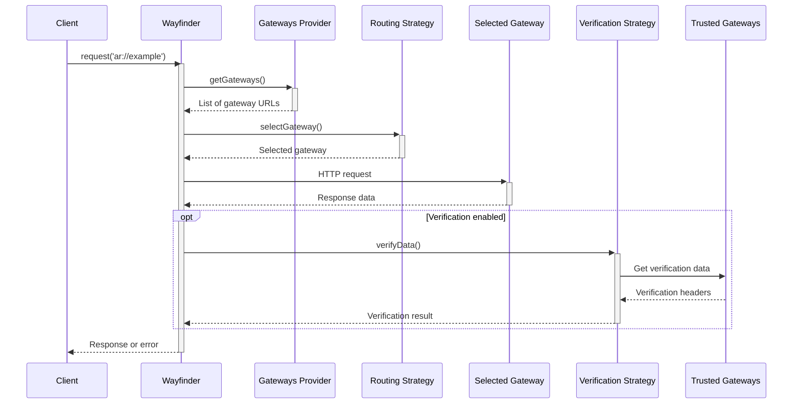

# Wayfinder Core

`@ar.io/wayfinder-core` is the core library for the Wayfinder project. It provides the core functionality for routing and verifying data through the ar.io network.

## Quick Start

### Installation

To install the latest version, run:

```bash
npm install @ar.io/wayfinder-core
# or
yarn add @ar.io/wayfinder-core
```

### Basic Usage

```javascript
import { createWayfinderClient } from '@ar.io/wayfinder-core';

// Creates a Wayfinder client with sensible defaults:
// - Trusted peers gateway provider with caching (5 minute TTL)
// - Random routing strategy
// - Verification disabled
const wayfinder = createWayfinderClient();

// Use Wayfinder to fetch data using ar:// protocol
const response = await wayfinder.request('ar://example-name');
```

### Using with AR.IO Network

```javascript
import {
  createWayfinderClient,
  FastestPingRoutingStrategy,
  NetworkGatewaysProvider,
} from '@ar.io/wayfinder-core';
import { ARIO } from '@ar.io/sdk';

const gatewaysProvider = new NetworkGatewaysProvider({
  ario: ARIO.mainnet(),
  sortBy: 'operatorStake',
  sortOrder: 'desc',
  limit: 10,
});

const wayfinder = createWayfinderClient({
  routingSettings: {
    strategy: new FastestPingRoutingStrategy({ gatewaysProvider }),
  },
});
```

### Enable Verification

```javascript
import {
  createWayfinderClient,
  HashVerificationStrategy,
} from '@ar.io/wayfinder-core';

const wayfinder = createWayfinderClient({
  verificationSettings: {
    enabled: true,
    strategy: new HashVerificationStrategy({
      trustedGateways: [new URL('https://permagate.io')],
    }),
    strict: true, // Fail requests on verification errors
  },
});
```

Wayfinder Core provides helper functions to construct routing and verification strategies:

### createRoutingStrategy

Create routing strategies with a simple string identifier:

```javascript
import { createRoutingStrategy } from '@ar.io/wayfinder-core';

// Create a random routing strategy
const randomStrategy = createRoutingStrategy({
  strategy: 'random',
  gatewaysProvider: myGatewaysProvider,
  logger: myLogger,
});

// Available strategies: 'random', 'fastest', 'balanced', 'preferred'
```

### createVerificationStrategy

Create verification strategies with a simple string identifier:

```javascript
import { createVerificationStrategy } from '@ar.io/wayfinder-core';

// Create a hash verification strategy
const hashStrategy = createVerificationStrategy({
  strategy: 'hash',
  trustedGateways: [new URL('https://permagate.io')],
  logger: myLogger,
});

// Available strategies: 'hash', 'data-root', 'remote', 'disabled'
```

## ar:// Protocol

Wayfinder supports several ar:// URL formats:

```bash
ar://TRANSACTION_ID              # Direct transaction ID
ar://NAME                        # ArNS name (paths supported)
ar:///info                       # Gateway endpoint (/info)
```

## Dynamic Routing

Wayfinder supports a `resolveUrl` method which generates dynamic redirect URLs to a target gateway based on the provided routing strategy.  This function can be used to directly replace any hard-coded gateway URLs, and instead use Wayfinder's routing logic to select a gateway for the request.

#### ArNS names

Given an ArNS name, the redirect URL will be the same as the original URL, but with the gateway selected by Wayfinder's routing strategy.

```javascript
const redirectUrl = await wayfinder.resolveUrl({
  arnsName: 'ardrive',
});
// results in https://ardrive.<selected-gateway>
```

#### Transaction Ids

Given a txId, the redirect URL will be the same as the original URL, but with the gateway selected by Wayfinder's routing strategy.

```javascript
const redirectUrl = await wayfinder.resolveUrl({
  txId: 'example-tx-id',
});
// results in https://<selected-gateway>/example-tx-id
```

#### Legacy URLs

Given a legacy arweave.net or arweave.dev URL, the redirect URL will be the same as the original URL, but with the gateway selected by Wayfinder's routing strategy.

```javascript
const redirectUrl = await wayfinder.resolveUrl({
  originalUrl: 'https://arweave.net/example-tx-id',
});
// results in https://<selected-gateway>/example-tx-id
```

#### ar:// URLs

Given an ar:// URL, the redirect URL will be the same as the original URL, but with the gateway selected by Wayfinder's routing strategy.

```javascript
const redirectUrl = await wayfinder.resolveUrl({
  originalUrl: 'ar://example-name/subpath?query=value',
});
// results in https://<selected-gateway>/example-name/subpath?query=value
```

## Gateway Providers

Gateway providers supply the list of gateways for routing. **By default, `createWayfinderClient` uses a cached `TrustedPeersGatewaysProvider`**.

| Provider                       | Description                                    | Use Case                                |
| ------------------------------ | ---------------------------------------------- | --------------------------------------- |
| `NetworkGatewaysProvider`      | Returns gateways from AR.IO Network | Leverage AR.IO Network with quality filtering |
| `TrustedPeersGatewaysProvider` | Fetches from trusted gateway's peers | Dynamic gateway discovery (default) |
| `StaticGatewaysProvider`       | Returns a static list of gateways | Testing or specific gateways |
| `SimpleCacheGatewaysProvider`  | In-memory caching wrapper | Reduce API calls (used by default) |
| `LocalStorageGatewaysProvider` | Browser localStorage caching | Persistent caching (used by default in browsers) |

### NetworkGatewaysProvider

Returns a list of gateways from the ARIO Network based on on-chain [Gateway Address Registry](https://docs.ar.io/learn/gateways/gateway-registry). You can specify on-chain metrics for gateways to prioritize the highest quality gateways. This requires installing the `@ar.io/sdk` package and importing the `ARIO` object.

```javascript
import { NetworkGatewaysProvider } from '@ar.io/wayfinder-core';
import { ARIO } from '@ar.io/sdk';

const gatewayProvider = new NetworkGatewaysProvider({
  ario: ARIO.mainnet(),
  sortBy: 'operatorStake',
  sortOrder: 'desc',
  limit: 10,
  filter: (gateway) => gateway.status === 'joined',
});
```

### TrustedPeersGatewaysProvider

Fetches a dynamic list of trusted peer gateways from an AR.IO gateway's `/ar-io/peers` endpoint. This provider is useful for discovering available gateways from a trusted source.

```javascript
import { TrustedPeersGatewaysProvider } from '@ar.io/wayfinder-core';

const gatewayProvider = new TrustedPeersGatewaysProvider({
  trustedGateway: 'https://arweave.net',
});
```

## Routing Strategies

Wayfinder supports multiple routing strategies to select target gateways for your requests.

| Strategy                     | Description                                    | Use Case                                |
| ---------------------------- | ---------------------------------------------- | --------------------------------------- |
| `RandomRoutingStrategy`      | Selects a random gateway from a list           | Good for load balancing and resilience  |
| `StaticRoutingStrategy`      | Always uses a single gateway                   | When you need to use a specific gateway |
| `RoundRobinRoutingStrategy`  | Selects gateways in round-robin order          | Good for load balancing and resilience  |
| `FastestPingRoutingStrategy` | Selects the fastest gateway based on ping time | Good for performance and latency        |
| `PreferredWithFallbackRoutingStrategy` | Uses a preferred gateway, with a fallback strategy if the preferred gateway is not available | Good for performance and resilience. Ideal for builders who run their own gateways. |
| `CompositeRoutingStrategy` | Chains multiple routing strategies together, trying each sequentially until one succeeds | Good for complex fallback scenarios and maximum resilience |

#### RandomRoutingStrategy

Selects a random gateway from a list of gateways.

```javascript
import { RandomRoutingStrategy } from '@ar.io/wayfinder-core';

const strategy = new RandomRoutingStrategy({
  gatewaysProvider: myGatewaysProvider,
});
```

#### FastestPingRoutingStrategy

```javascript
import { FastestPingRoutingStrategy } from '@ar.io/wayfinder-core';

const strategy = new FastestPingRoutingStrategy({
  timeoutMs: 1000,
  gatewaysProvider: myGatewaysProvider,
});
```

#### PreferredWithFallbackRoutingStrategy

Uses a preferred gateway, with a fallback strategy if the preferred gateway is not available. This is useful for builders who run their own gateways and want to use their own gateway as the preferred gateway, but also want to have a fallback strategy in case their gateway is not available.

> [!INFO]
> This strategy is built using `CompositeRoutingStrategy` internally. It first attempts to ping the preferred gateway (using `PingRoutingStrategy` with `StaticRoutingStrategy`), and if that fails, it falls back to the specified fallback strategy.

```javascript
import { PreferredWithFallbackRoutingStrategy, FastestPingRoutingStrategy } from '@ar.io/wayfinder-core';

const strategy = new PreferredWithFallbackRoutingStrategy({
  preferredGateway: 'https://my-gateway.com',
  fallbackStrategy: new FastestPingRoutingStrategy({ timeoutMs: 500 }),
});
```

#### CompositeRoutingStrategy

The `CompositeRoutingStrategy` allows you to chain multiple routing strategies together, providing maximum resilience by trying each strategy in sequence until one succeeds. This is ideal for complex fallback scenarios where you want to combine different routing approaches.

**How it works:**

1. Tries each strategy in the order they're provided
2. If a strategy successfully returns a gateway, that gateway is used (remaining strategies are skipped)
3. If a strategy throws an error, moves to the next strategy
4. If all strategies fail, throws an error

**Common use cases:**

- **Performance + Resilience**: Try fastest ping first, fallback to random if ping fails
- **Preferred + Network**: Use your own gateway first, fallback to AR.IO network selection
- **Multi-tier Fallback**: Try premium gateways, then standard gateways, then any available gateway

```javascript
import { 
  CompositeRoutingStrategy, 
  FastestPingRoutingStrategy, 
  RandomRoutingStrategy,
  StaticRoutingStrategy,
  NetworkGatewaysProvider 
} from '@ar.io/wayfinder-core';
import { ARIO } from '@ar.io/sdk';

// Example 1: Performance-first with resilience fallback
const performanceStrategy = new CompositeRoutingStrategy({
  strategies: [
    // Try fastest ping first (high performance, but may fail if all gateways are slow)
    new FastestPingRoutingStrategy({
      timeoutMs: 500,
      gatewaysProvider: new NetworkGatewaysProvider({
        ario: ARIO.mainnet(),
        sortBy: 'operatorStake',
        limit: 10,
      }),
    }),
    // Fallback to random selection (guaranteed to work if gateways exist)
    new RandomRoutingStrategy({
      gatewaysProvider: new NetworkGatewaysProvider({
        ario: ARIO.mainnet(),
        sortBy: 'operatorStake', 
        limit: 20, // Use more gateways for fallback
      }),
    }),
  ],
});

// Example 2: Preferred gateway with multi-tier fallback
const preferredStrategy = new CompositeRoutingStrategy({
  strategies: [
    // First, try your preferred gateway
    new StaticRoutingStrategy({ 
      gateway: 'https://my-preferred-gateway.com' 
    }),
    // If that fails, try fastest ping from top-tier gateways
    new FastestPingRoutingStrategy({
      timeoutMs: 1000,
      gatewaysProvider: new NetworkGatewaysProvider({
        ario: ARIO.mainnet(),
        sortBy: 'operatorStake',
        limit: 5, // Only top 5 gateways
      }),
    }),
    // Final fallback: any random gateway from a larger pool
    new RandomRoutingStrategy({
      gatewaysProvider: new NetworkGatewaysProvider({
        ario: ARIO.mainnet(),
        limit: 50, // Larger pool for maximum availability
      }),
    }),
  ],
});

// Use with createWayfinderClient
const wayfinder = createWayfinderClient({
  routingSettings: {
    strategy: performanceStrategy,
  },
});
```

## Verification Strategies

Wayfinder includes verification mechanisms to ensure the integrity of retrieved data. Verification strategies offer different trade-offs between complexity, performance, and security.

| Verifier                        | Complexity | Performance | Security | Description                                                                                                  |
| ------------------------------- | ---------- | ----------- | -------- | ------------------------------------------------------------------------------------------------------------ |
| `RemoteVerificationStrategy`    | Low        | Low         | Low      | Checks the `x-ar-io-verified` header from the gateway that returned the data. If `true`, the data is considered verified and trusted. |
| `HashVerificationStrategy`      | Low        | High        | Low      | Computes the SHA-256 hash of the returned data and comparing it to the hash of a **trusted gateway** (_**recommended for most users**_).                                   |
| `DataRootVerificationStrategy`  | Medium     | Medium      | Low      | Computes the data root for the transaction (most useful for L1 transactions) and compares it to the data root provided by a **trusted gateway**. |
| `SignatureVerificationStrategy` | Medium     | Medium      | Medium   | - **ANS-104 Data Items**: Fetches signature components (owner, signature type, tags, etc.) from trusted gateways using range requests, then verifies signatures against the data payload using deep hash calculations following the ANS-104 standard.<br/>- **L1 Transactions**: Retrieves transaction metadata from gateway /tx/<tx-id> endpoints, computes the data root from the provided data stream, and verifies the signature using Arweave's cryptographic verification. |

#### RemoteVerificationStrategy

This strategy is used to verify data by checking the `x-ar-io-verified` header from the gateway that returned the data. If the header is set to `true`, the data is considered verified and trusted.

> [!IMPORTANT]
> This strategy is only recommended for users fetching data from their own gateways and want to avoid the overhead of the other verification strategies.

```javascript
import { Wayfinder, RemoteVerificationStrategy } from '@ar.io/wayfinder-core';

const wayfinder = new Wayfinder({
  verificationSettings: {
    // no trusted gateways are required for this strategy
    enabled: true,
    strategy: new RemoteVerificationStrategy(),
  },
});
```

#### HashVerificationStrategy

Verifies data integrity using SHA-256 hash comparison. This is the default verification strategy and is recommended for most users looking for a balance between security and performance.

```javascript
import { Wayfinder, HashVerificationStrategy } from '@ar.io/wayfinder-core';

const wayfinder = new Wayfinder({
  verificationSettings: {
    enabled: true,
    strategy: new HashVerificationStrategy({
      trustedGateways: [new URL('https://permagate.io')],
    }),
  },
});
```

#### DataRootVerificationStrategy

Verifies data integrity using Arweave by computing the data root for the transaction. This is useful for L1 transactions and is recommended for users who want to ensure the integrity of their data.

```javascript
import { Wayfinder, DataRootVerificationStrategy } from '@ar.io/wayfinder-core';

const wayfinder = new Wayfinder({
  verificationSettings: {
    enabled: true,
    strategy: new DataRootVerificationStrategy({
      trustedGateways: [new URL('https://permagate.io')],
    }),
  },
});
```

#### SignatureVerificationStrategy

Verifies signatures of Arweave transactions and data items. Headers are retrieved from trusted gateways for use during verification. For a transaction, its data root is computed while streaming its data and then utilized alongside its headers for verification. For data items, the ANS-104 deep hash method of signature verification is used.

```javascript
import { Wayfinder, SignatureVerificationStrategy } from '@ar.io/wayfinder-core';

const wayfinder = new Wayfinder({
  verificationSettings: {
    enabled: true,
    strategy: new SignatureVerificationStrategy({
      trustedGateways: [new URL('https://permagate.io')],
    }),
  },
});
```

## x402 Payments

Wayfinder can be configured to work with the [x402 payment protocol](https://docs.ar.io/learn/gateways/x402-payments#what-is-x402) for paid gateway services and higher rate limits. This allows you to seamlessly make requests that may require payment without having to manually handle payment flows.

> [!IMPORTANT]
> To use x402 payments, you need to install the `@ar.io/wayfinder-x402-fetch` package.

```npm
npm install @ar.io/wayfinder-x402-fetch viem
```

```javascript
import { createWayfinderClient } from '@ar.io/wayfinder-core';
import { createX402Fetch } from '@ar.io/wayfinder-x402-fetch';
import { privateKeyToAccount } from 'viem/accounts';

// Set up your wallet for x402 payments
const privateKey = process.env.X402_PRIVATE_KEY; // Your private key
const account = privateKeyToAccount(privateKey);

// Create x402-enabled fetch implementation
const x402Fetch = createX402Fetch({
  walletClient: account,
});

// Create Wayfinder client with x402 fetch
const wayfinder = createWayfinderClient({
  fetch: x402Fetch,
  routingSettings: {
    // Configure to use x402-enabled gateways
    strategy: new StaticRoutingStrategy({
      gateway: 'https://paid-gateway.example.com',
    }),
  },
});

// Requests will now automatically handle x402 payments
const response = await wayfinder.request('ar://transaction-id');
```

**How it works:**

1. When a gateway returns a `402 Payment Required` status
2. The x402 fetch automatically handles the payment flow
3. The request is retried with payment credentials
4. You get access to premium gateway services

**Use cases:**

- Access to faster, more reliable premium gateways
- High-availability data retrieval with SLA guarantees
- Priority routing through paid gateway networks

To learn more about x402 payments, visit the [x402 documentation](https://docs.ar.io/learn/gateways/x402-payments).

## Events and Monitoring

### Global Events

```javascript
const wayfinder = createWayfinderClient({
  routingSettings: {
    events: {
      onRoutingStarted: (event) => console.log('Routing started:', event),
      onRoutingSucceeded: (event) => console.log('Gateway selected:', event),
    },
  },
  verificationSettings: {
    events: {
      onVerificationProgress: (event) => {
        const percentage = (event.processedBytes / event.totalBytes) * 100;
        console.log(`Verification: ${percentage.toFixed(2)}%`);
      },
      onVerificationSucceeded: (event) => console.log('Verified:', event.txId),
    },
  },
});
```

### Request-Specific Events

```javascript
const response = await wayfinder.request('ar://example', {
  verificationSettings: {
    events: {
      onVerificationProgress: (event) => {
        console.log(`This request: ${event.txId}`);
      },
    },
  },
});
```

## Telemetry

Wayfinder can optionally emit OpenTelemetry spans for every request. **By default, telemetry is disabled**. You can control this behavior with the `telemetry` option.

```typescript
import { createWayfinderClient } from '@ar.io/wayfinder-core';

const wayfinder = createWayfinderClient({
  // other settings...
  telemetrySettings: {
    enabled: true,
    sampleRate: 0.1, // 10% sampling
    exporterUrl: 'https://your-otel-exporter',
    clientName: 'my-app',
    clientVersion: '1.0.0',
  },
});
```

## Request Flow


